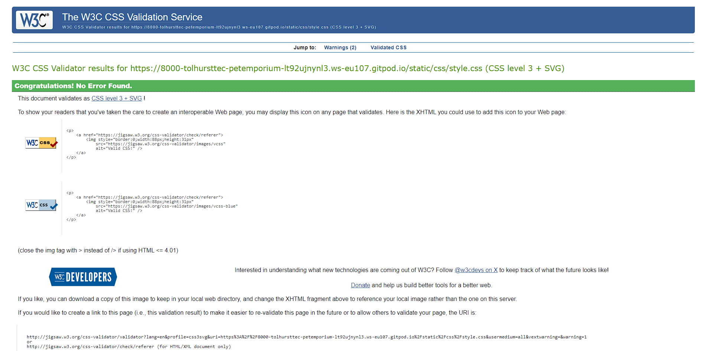
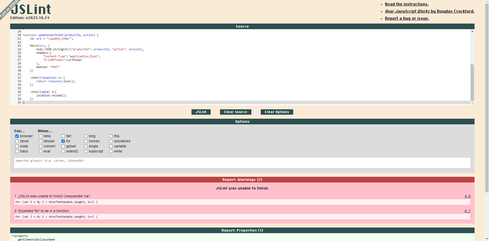
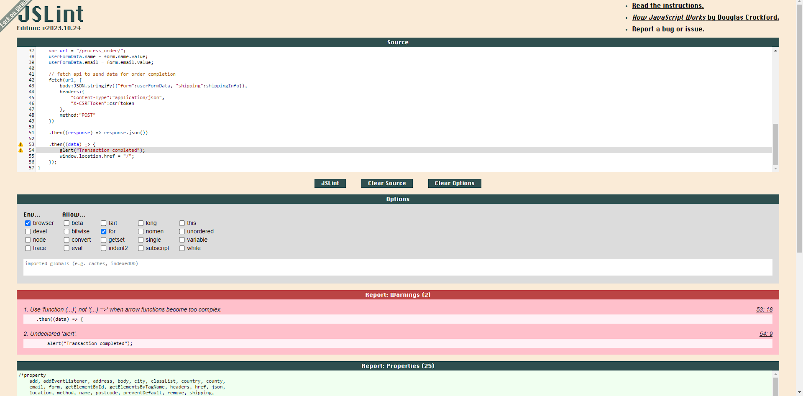
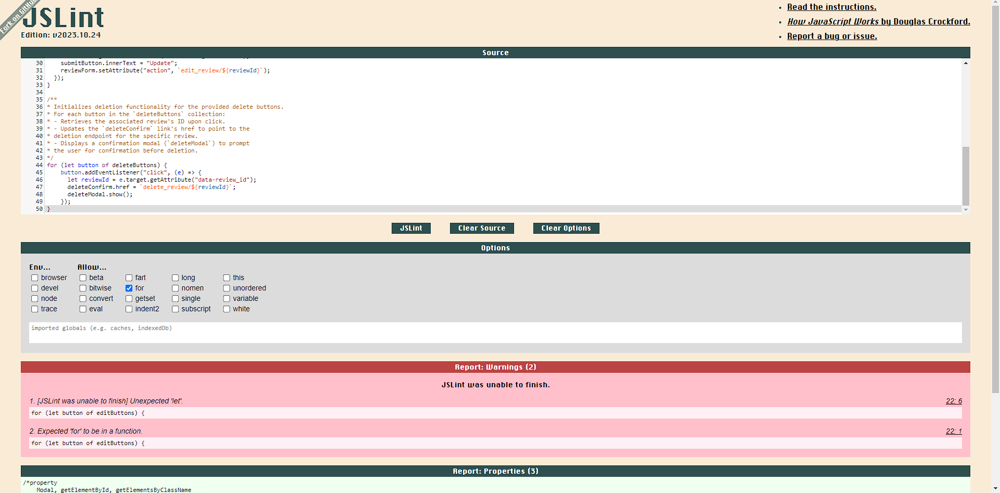
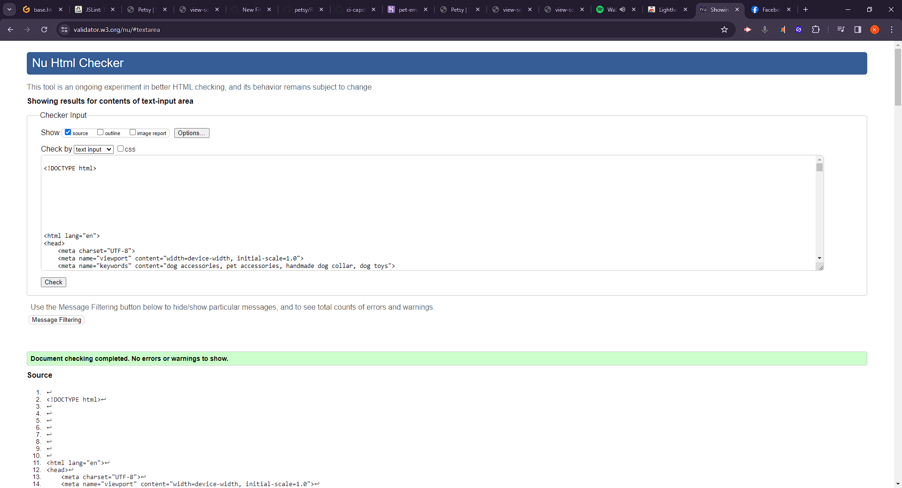
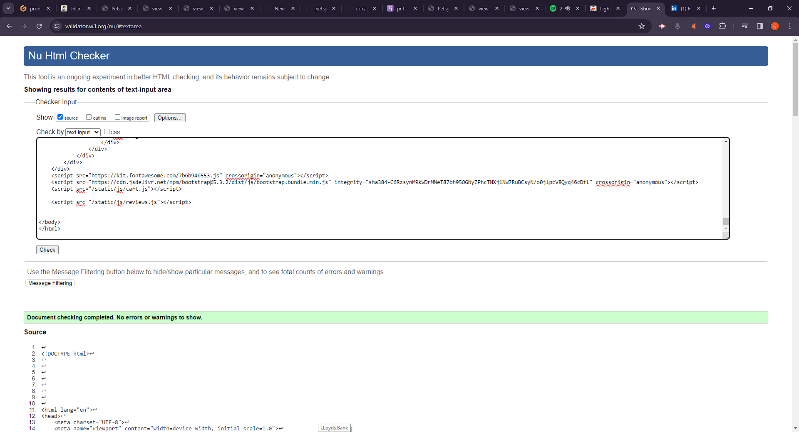
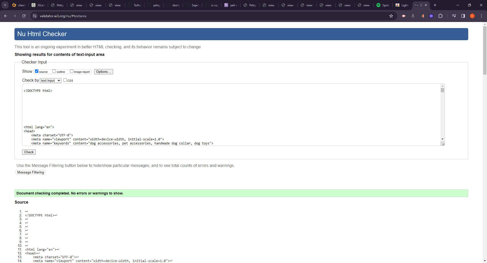

# Validation
[Click Here](README.md) To go back to the README.md

## W3C CSS Validation

I used W3C to validate my CSS and fix any conformity errors.

## JSLint JavaScript Validation
I validated all my JS scripts with JSLint. A couple of minor errors were left as I didn't put some logic inside functions leaving some global variables and didn't quite have time to fix that at this stage.

### Cart JS validation.

### Checkout JS validation.

### Review JS validation.

## W3C HTML Validation

### Home/Store

### Product

### Cart

### Checkout

