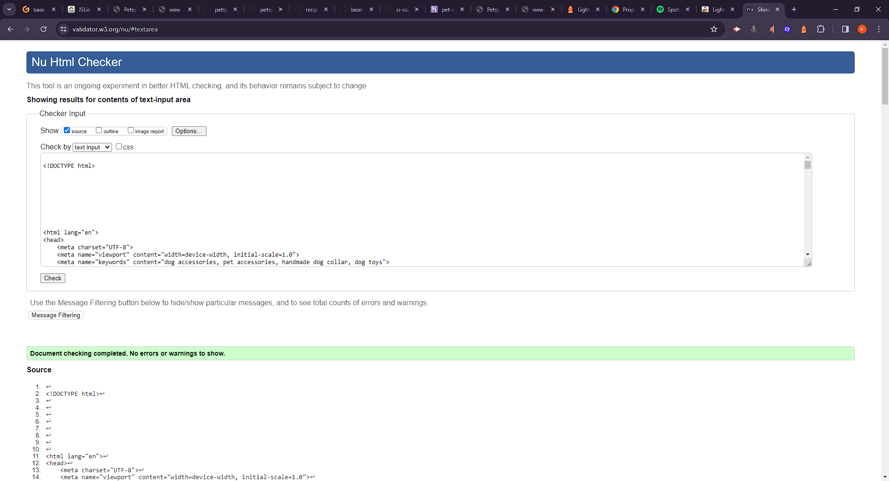
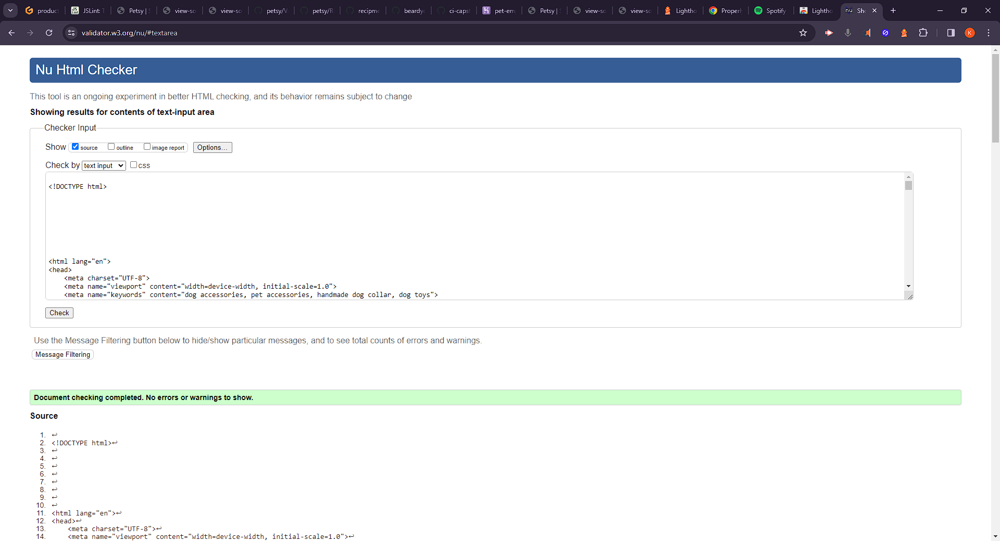
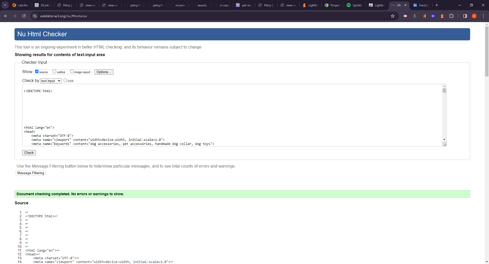

# Validation
[Click Here](README.md) To go back to the README.md

## W3C CSS Validation

I used W3C to validate my CSS and fix any conformity errors.

## JSLint JavaScript Validation
I validated all my JS scripts with JSLint. A couple of minor errors were left as I didn't put some logic inside functions leaving some global variables and didn't quite have time to fix that at this stage.
### Cart JS validation.

### Checkout JS validation.

### Review JS validation.

## W3C HTML Validation
Validated the html both in logged in and logged out states as the html is slightly different for both.
I also validated the html with a full basket to test for errors there, too, and found some that don't show on an empty basket.
I found some errors in different states and cleaned them all up.
### Home/Store - logged out

### Product - logged out

### Cart - logged out

### Checkout - logged out

### Home/Store - logged in

### Product - logged in

### Cart - logged in

### Checkout - logged in

## Python Validation

